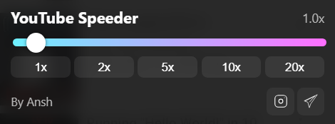

# 🎥 YouTube Speeder

A Chrome extension that lets you **control YouTube playback speed** from **0.1x up to 20x** with a beautiful slider UI.  
Perfect for fast learners, slow motion replays, or just having fun.

---

## ✨ Features
- Set playback speed from **0.1x** to **20x**
- Clean & modern UI with gradient slider
- Works instantly on any YouTube video
- Developed by **Ansh** 💻
- Quick links to my socials:
  - 📸 Instagram: [@anshmaybee](https://instagram.com/anshmaybee)
  - 💬 Telegram: [@highoncodes](https://t.me/highoncodes)

---

## 📷 Preview
**

---

## 📦 Installation (Manual - No Chrome Web Store)
Since we are not publishing this on the Chrome Web Store, you can install it manually:

1. **Download ZIP**
   - Click the green **Code** button on this repo → **Download ZIP**
   - Or [click here to download latest release](#) *(add GitHub release link if you make one)*

2. **Unzip the folder**
   - Right-click → Extract All

3. **Open Chrome Extensions**
   - Go to: `chrome://extensions`

4. **Enable Developer Mode**
   - Toggle switch in the top right corner

5. **Load the extension**
   - Click **Load unpacked**
   - Select the unzipped folder

6. **Enjoy YouTube Speeder 🎉**
   - Open YouTube, move the slider, and control speed however you want

---

## 🛠 How It Works
The extension injects a small control panel into YouTube pages that updates the `playbackRate` of the HTML5 video player in real-time.

---

## 📜 License
This project is open-source and free to use.  
You can modify it, but please credit **Ansh** if you share or re-upload.

---

## 💬 Contact
- 📸 Instagram: [@anshmaybee](https://instagram.com/anshmaybee)
- 💬 Telegram: [@highoncodes](https://t.me/highoncodes)
